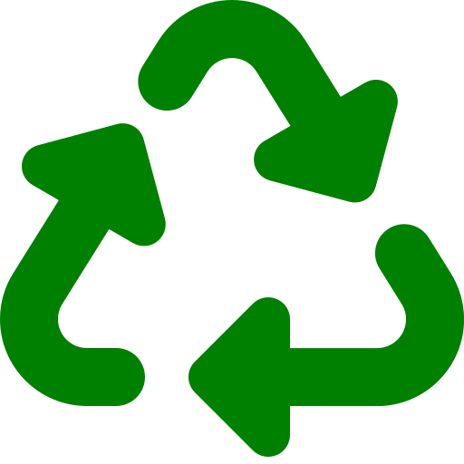

# 🌱 eRecycleChain

> **Revolutionizing E-Waste Management with AI-Powered Blockchain Verification**

[](https://reactjs.org/)
[](https://www.typescriptlang.org/)
[](https://soliditylang.org/)
[](https://tailwindcss.com/)
[](https://wagmi.sh/)
[](https://polygon.technology/)

<div align="center">
  
</div>

## 🚀 Overview

eRecycleChain is a cutting-edge decentralized application that combines **blockchain technology**, **AI-powered image verification**, and **gamification** to create a sustainable e-waste recycling ecosystem. Users can submit electronic waste items, earn cryptocurrency rewards, and contribute to environmental conservation through a transparent, immutable blockchain network.

## ✨ Key Features

### 🔗 **Currently Implemented**

#### **Smart Contract Infrastructure**
- **EwasteTracker Contract**: Manages e-waste item submissions and verification
- **RewardToken (RECY)**: ERC-20 token for rewarding verified submissions
- **Status Tracking**: Three-stage process (Submitted → Collected → Verified)
- **Event System**: Real-time blockchain events for frontend integration

#### **AI-Powered Verification**
- **HuggingFace Integration**: Uses Google's ViT model for image classification
- **Real-time AI Verification**: Instant image analysis during item submission
- **Smart Matching**: AI compares uploaded images with declared item types
- **Fallback Handling**: Graceful error handling for AI API failures

#### **User Dashboard**
- **E-Waste Submission Form**: Upload items with images and location data
- **Item Verification System**: AI-powered verification with blockchain confirmation
- **Status Checking**: Real-time item status tracking by ID
- **Transaction Summary**: Comprehensive user activity overview
- **Leaderboard**: Competitive ranking system with badges

#### **Reward System**
- **RECY Token Rewards**: 10 RECY tokens per verified item
- **Badge System**: Progressive achievement badges
  - 🌟 First Submission
  - 🌿 Green Starter
  - 🏅 Eco Collector (5+ items)
  - 🌍 Planet Guardian (10+ items)
- **Leaderboard Rankings**: Competitive verification leaderboard

#### **Blockchain Integration**
- **Polygon Amoy Testnet**: Deployed on Polygon's test network
- **RainbowKit Wallet**: Seamless wallet connection
- **Wagmi Integration**: Modern React hooks for blockchain interaction
- **Real-time Updates**: Live blockchain data synchronization

#### **UI/UX Features**
- **Responsive Design**: Mobile-first approach with Tailwind CSS
- **Dark/Light Mode**: Complete theme switching
- **Smooth Animations**: Beautiful micro-interactions and transitions
- **Modern Design System**: shadcn/ui components with custom theming
- **Accessibility**: ARIA labels and semantic HTML

### 🚧 **Coming Soon**

#### **Advanced Smart Contract Features**
- [ ] **NFT Certificates**: Unique NFTs for verified environmental contributions
- [ ] **DAO Governance**: Community-driven decision making
- [ ] **Staking Mechanism**: Stake RECY tokens for additional rewards
- [ ] **Advanced Access Control**: Role-based permissions system
- [ ] **Gas Optimization**: Improved contract efficiency

#### **Enhanced AI Capabilities**
- [ ] **Multi-Model AI**: Support for multiple AI models
- [ ] **Offline AI**: Local AI processing capabilities
- [ ] **Advanced Image Analysis**: Damage assessment and value estimation
- [ ] **AI Model Versioning**: Track and update AI models
- [ ] **Custom Training**: Platform-specific AI model training

#### **Gamification & Social Features**
- [ ] **Achievement System**: Extended badge and title system
- [ ] **Social Profiles**: User profiles with environmental impact stats
- [ ] **Community Challenges**: Time-limited recycling challenges
- [ ] **Referral System**: Reward users for bringing new participants
- [ ] **Environmental Impact NFTs**: Unique NFTs based on impact metrics

#### **Advanced Analytics & Reporting**
- [ ] **Environmental Impact Dashboard**: Real-time CO2 savings tracking
- [ ] **Analytics API**: Comprehensive data export capabilities
- [ ] **Impact Visualization**: Interactive charts and graphs
- [ ] **Carbon Credit Integration**: Convert RECY to carbon credits
- [ ] **Sustainability Reports**: Automated environmental impact reports

#### **Enterprise Features**
- [ ] **Bulk Submission**: Corporate e-waste management
- [ ] **API Access**: RESTful API for third-party integrations
- [ ] **White-label Solutions**: Customizable platform for organizations
- [ ] **Advanced Reporting**: Corporate sustainability reporting
- [ ] **Multi-chain Support**: Support for multiple blockchain networks

## 🛠️ Technology Stack

### **Frontend**
- **React 18.3.1** - Modern React with concurrent features
- **TypeScript 5.5.3** - Type-safe development
- **Vite 5.4.1** - Fast build tool and dev server
- **Tailwind CSS 3.4.11** - Utility-first CSS framework
- **shadcn/ui** - Beautiful, accessible component library
- **Lucide React** - Beautiful & consistent icon toolkit

### **Blockchain & Web3**
- **Solidity 0.8.20** - Smart contract development
- **Hardhat** - Ethereum development environment
- **Wagmi 2.15.6** - React hooks for Ethereum
- **RainbowKit 2.2.8** - Wallet connection UI
- **Ethers.js 6.14.4** - Ethereum library
- **Polygon Amoy** - Testnet deployment

### **AI & Machine Learning**
- **HuggingFace API** - AI model inference
- **Google ViT Model** - Vision Transformer for image classification
- **Base64 Image Processing** - Client-side image handling

### **Development Tools**
- **ESLint** - Code linting
- **Prettier** - Code formatting
- **TypeScript ESLint** - TypeScript-specific linting
- **PostCSS** - CSS processing
- **Autoprefixer** - CSS vendor prefixing

## 📦 Installation & Setup

### **Prerequisites**
- Node.js 18+ 
- npm or yarn
- MetaMask or any Web3 wallet
- Polygon Amoy testnet configured

### **1. Clone the Repository**
```bash
git clone https://github.com/KrishPatel1010/eRecycleChain.git
cd eRecycleChain
```

### **2. Install Dependencies**
```bash
npm install
```

### **3. Environment Configuration**
Create a `.env` file in the root directory:
```env
# Blockchain Configuration
VITE_TRACKER_ADDRESS=your_deployed_tracker_address
VITE_REWARD_TOKEN_ADDRESS=your_deployed_token_address
POLYGON_RPC_URL=your_polygon_rpc_url
PRIVATE_KEY=your_deployer_private_key

# AI Configuration
VITE_HF_API_KEY=your_huggingface_api_key

# WalletConnect (Optional)
VITE_WALLET_CONNECT_PROJECT_ID=your_wallet_connect_project_id
```

### **4. Deploy Smart Contracts**
```bash
# Compile contracts
npx hardhat compile

# Deploy to Polygon Amoy testnet
npx hardhat run scripts/deploy.ts --network amoy
```

### **5. Start Development Server**
```bash
npm run dev
```

Visit `http://localhost:5173` to see the application.

## 🏗️ Project Structure

```
eRecycleChain/
├── contracts/                 # Smart contracts
│   ├── EwasteTracker.sol     # Main tracking contract
│   └── RewardToken.sol       # ERC-20 reward token
├── scripts/                   # Deployment scripts
│   ├── deploy.ts             # Main deployment script
│   └── deploy-tracker.ts     # Alternative deployment
├── src/
│   ├── abis/                 # Contract ABIs
│   ├── components/           # React components
│   │   ├── dashboard/        # Dashboard-specific components
│   │   └── ui/              # Reusable UI components
│   ├── hooks/               # Custom React hooks
│   ├── lib/                 # Utility functions
│   ├── pages/               # Page components
│   └── main.tsx            # Application entry point
├── public/                  # Static assets
└── hardhat.config.ts       # Hardhat configuration
```

## 🔧 Smart Contracts

### **EwasteTracker Contract**
```solidity
// Key Functions
function submitItem(string memory itemType, string memory location) external
function verifyItem(uint256 itemId) external onlyCollector
function getItem(uint256 itemId) external view returns (EwasteItem memory)

// Events
event ItemSubmitted(uint256 indexed id, address indexed user)
event ItemVerified(uint256 indexed id, address indexed collector, uint256 reward)
```

### **RewardToken Contract**
```solidity
// ERC-20 Token with minting capability
contract RewardToken is ERC20, Ownable {
    function mint(address to, uint256 amount) public onlyOwner
}
```

## 🎮 How It Works

### **1. Submit E-Waste**
1. Connect your Web3 wallet
2. Fill out the submission form with item details
3. Upload an image of the e-waste item
4. Submit to the blockchain network

### **2. AI Verification**
1. AI analyzes the uploaded image
2. Compares with declared item type
3. Provides verification confidence score
4. Approves or rejects the submission

### **3. Blockchain Confirmation**
1. Smart contract processes the verification
2. Updates item status to "Verified"
3. Mints RECY tokens to user wallet
4. Emits verification event

### **4. Earn Rewards**
1. Receive 10 RECY tokens per verified item
2. Earn badges based on submission count
3. Climb the leaderboard rankings
4. Track environmental impact

## 🎯 Use Cases

### **Individual Users**
- **Home E-Waste Recycling**: Submit household electronics
- **Earn Cryptocurrency**: Get paid in RECY tokens
- **Environmental Impact**: Track personal contribution
- **Gamification**: Earn badges and compete on leaderboard

### **Educational Institutions**
- **Student Engagement**: Educational recycling programs
- **Environmental Awareness**: Teach blockchain and sustainability
- **Research Projects**: Study e-waste management patterns

### **Future: Corporate Partners**
- **Bulk E-Waste Management**: Corporate recycling programs
- **Sustainability Reporting**: Automated impact tracking
- **Carbon Credit Integration**: Convert RECY to carbon credits

## 🌍 Environmental Impact

### **Current Metrics**
- **CO₂ Emissions Saved**: Tracked per verified item
- **Energy Conservation**: Calculated based on recycling impact
- **Water Saved**: Environmental resource preservation
- **Devices Recycled**: Total count of processed items

### **Future Impact Tracking**
- **Real-time Analytics**: Live environmental impact dashboard
- **Carbon Credit Integration**: Convert RECY to verified carbon credits
- **Sustainability Reports**: Automated impact reporting
- **Global Impact Visualization**: Interactive world map of contributions

## 🔒 Security & Privacy

### **Smart Contract Security**
- **OpenZeppelin Contracts**: Battle-tested security libraries
- **Access Control**: Role-based permissions
- **Event Logging**: Transparent transaction tracking
- **Input Validation**: Comprehensive parameter checking

### **Data Privacy**
- **Local Storage**: Images stored locally in browser
- **No Central Database**: Decentralized data storage
- **Blockchain Transparency**: Immutable public records
- **User Control**: Users own their data

### **Future Security Enhancements**
- **Professional Audits**: Third-party security audits
- **Multi-signature Wallets**: Enhanced security for large transactions
- **Advanced Encryption**: End-to-end data encryption
- **Privacy Features**: Optional data anonymization

## 🚀 Deployment

### **Testnet Deployment**
```bash
# Deploy to Polygon Amoy testnet
npx hardhat run scripts/deploy.ts --network amoy
```

### **Production Deployment**
```bash
# Deploy to Polygon mainnet (Future)
npx hardhat run scripts/deploy.ts --network polygon
```

### **Environment Variables**
Update your `.env` file with production values:
```env
POLYGON_RPC_URL=https://polygon-rpc.com
PRIVATE_KEY=your_production_private_key
VITE_HF_API_KEY=your_production_hf_api_key
```

## 🤝 Contributing

We welcome contributions! Please see our [Contributing Guidelines](CONTRIBUTING.md) for details.

### **Development Setup**
1. Fork the repository
2. Create a feature branch
3. Make your changes
4. Add tests if applicable
5. Submit a pull request

### **Code Standards**
- Follow TypeScript best practices
- Use ESLint and Prettier
- Write meaningful commit messages
- Add JSDoc comments for functions

## 📄 License

This project is licensed under the MIT License - see the [LICENSE](LICENSE) file for details.

## 🙏 Acknowledgments

- **OpenZeppelin** for secure smart contract libraries
- **HuggingFace** for AI model infrastructure
- **Polygon** for scalable blockchain infrastructure
- **shadcn/ui** for beautiful UI components
- **Tailwind CSS** for utility-first styling

## 📞 Support & Community

- **Email**: krishpatel8463@gmail.com

## 🌟 Star History

[](https://star-history.com/#KrishPatel1010/eRecycleChain&Date)

---

<div align="center">
  <p>Made with ❤️ for a sustainable future</p>
  <p>🌱 <strong>eRecycleChain</strong> - Revolutionizing E-Waste Management</p>
</div> 